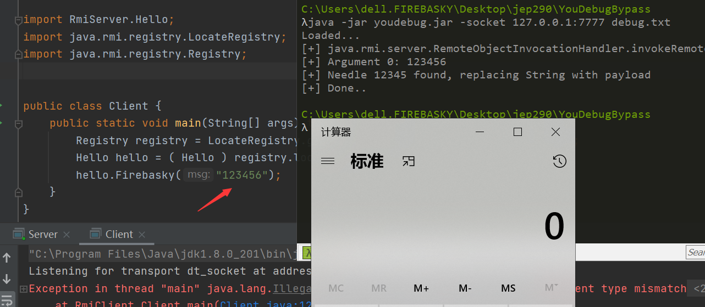

# Bypass jep290

## JavassistHookIRM

利用javassist技术 hookRemoteObjectInvocationHandler#invokeRemoteMethod 修改参数为我们的gadget。

生成的jar，然后通过javassist启动。同样配置jvm的参数。

```
-javaagent:C:\Users\xx\JavassistHookIRM\target\JavassistHookIRM-1.0-SNAPSHOT.jar
```

## YouDebugBypass

利用youdebug技术进行替换参数为我们的gadget。

youdebug命令

```
java -jar youdebug.jar -socket 127.0.0.1:7777 debug.txt
```

然后通过debug方式启动Client，直接在idea上配置jvm的参数。

```
-agentlib:jdwp=transport=dt_socket,server=y,address=127.0.0.1:7777
```

然后项目里面加载ysoserial.jar。



## 总结

该攻击方式有以下缺点：

1、仅当攻击者有权访问RMI服务时，才能攻击成功，因为我们是通过调用远程方法的方式进行攻击的。

2、攻击者需知道RMI服务接口中方法的签名，因为没有方法签名当然是无法去调用远程方法的，可以通过枚举常见的方法签名来进行攻击，例如：

```
login(String username, String password)
logMessage(int logLevel, String message)
log(int logLevel, String message)
```

>参考：
>
>https://mogwailabs.de/en/blog/2019/03/attacking-java-rmi-services-after-jep-290/
>
>https://blog.csdn.net/qsort_/article/details/104814905
